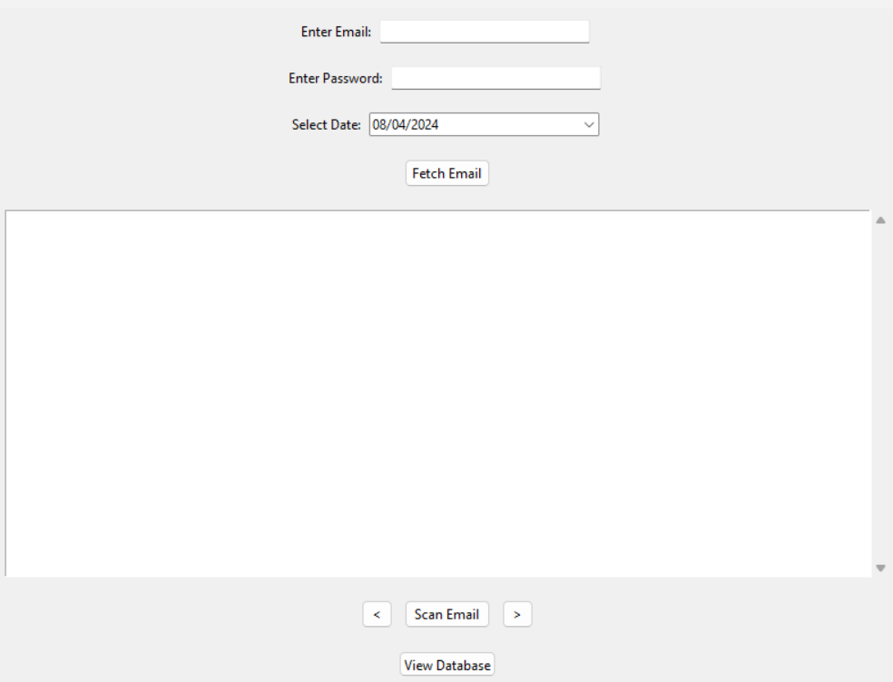
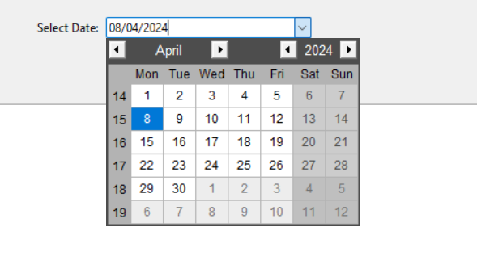
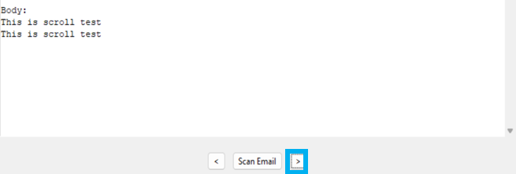
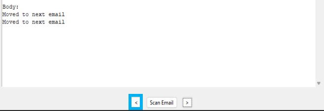
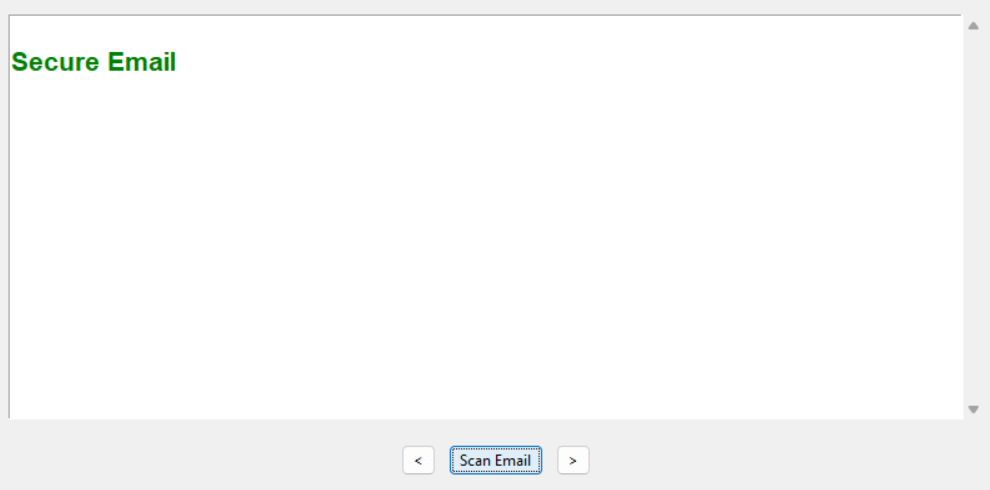
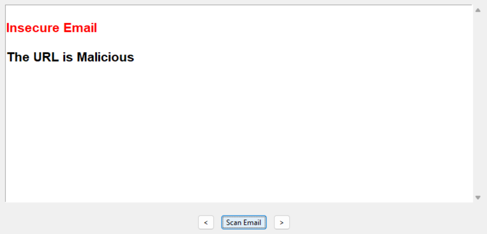

# Phishing Email Scanner

Phishing Email Scanner is a Python application that allows users to fetch emails from their Gmail account, scan them for phishing URLs using the VirusTotal API, and store insecure emails in a SQLite database for further analysis.

## Features

- **Email Fetching**: Fetch emails from Gmail using the IMAP protocol.
- **Phishing URL Detection**: Scan emails for phishing URLs using the VirusTotal API.
- **Database Storage**: Store insecure emails in a SQLite database for future reference.
- **User-Friendly Interface**: GUI built with Tkinter for ease of use.

## Prerequisites
**1. python should be preinstalled**
   - Ensure you have Python 3.x installed on your system. If not, you can download and install Python from the official [Python website](https://www.python.org/downloads/).

**2. If Gmail 2FA is enabled**
   - Ensure that two-factor authentication is disabled for your Gmail account, as the application currently does not support it.
   - If you have two-factor authentication enabled, you can create an "App Password" to use instead:
     1. Go to your Google Account settings.
     2. Under "Security," select "App passwords."
     3. Generate an App Password for the application.
     4. Use this App Password instead of your regular Gmail password in the application.
    
**3. Use Your Own VirusTotal API Key**
   - To use your own VirusTotal API key for scanning emails, follow these steps:
     1. Create an account on the [VirusTotal website](https://www.virustotal.com/).
     2. Once logged in, navigate to your account settings to find your API key.
     3. Copy your API key.
     4. Open the [`script.py`](script.py) file in your project directory using a text editor.
     5. Locate the line `VirusTotal_API_Key = "paste your api key here"` in the [`script.py`](script.py) file.
     6. Replace `"paste your api key here"` with your actual VirusTotal API key.
     7. Save the changes to the [`script.py`](script.py) file.

With your own VirusTotal API key added to the [`script.py`](script.py) file, the application will use your key for scanning emails for phishing URLs.

     

## Installation

1. Clone the repository:

    ```bash
    git clone https://github.com/piyush-rajpurohit/Phishing-email-scanner.git
    ```
    
2. Install the required packages:

    ```bash
    pip install beautifulsoup4 virustotal-python 
    ```

3. Run the application:

    ```bash
    phishing scanner.exe
    ```
**(Note: make sure phishing scanner.exe and script.py are in same path)**

## Overview

### 1. Landing Page

When the program is launched, users are greeted with a landing page where they can see the main options and features of the application.



### 2. Email ID and Password Input

To access their Gmail account, users need to input their email ID and password into the respective fields provided in the application.


### 3. Date Selection

Users can select the date for fetching emails from a calendar widget integrated into the application.



### 4. Email Fetching

After clicking the "Fetch Email" button, the program connects to the Gmail server via IMAP and retrieves emails sent on the selected date.


### 5. Moving Between Emails

After fetching emails, users can navigate between different emails using the "Previous" and "Next" buttons to view their contents.

 

### 6. Scan Email

To check for phishing URLs, users can select an email and click the "Scan Email" button, which triggers the scanning process using the VirusTotal API.

  

### 7. Storing Insecure Emails

If any insecure emails are detected during the scanning process, they are stored in a SQLite database for future reference. To see the stored data press view database buttton


### 8. Viewing Database

Users can view the contents of the database to analyze stored emails and take appropriate actions. clear database is used to cleare the history it clear all the previous history

   

## Workflow Diagram

Below diagram show the working of program

[flowchart diagram](screenshot/flowchart.png)

## Contributing

Contributions are welcome! If you find any bugs or have suggestions for improvements, please open an issue or submit a pull request.

## License

This project is licensed under the MIT License - see the [LICENSE](LICENSE) file for details.

## Credit
**VirusTotal API Attribution:**

This project utilizes the VirusTotal API for scanning URLs in Email. For more information about the VirusTotal API and its terms of use, please visit [VirusTotal](https://www.virustotal.com/).

